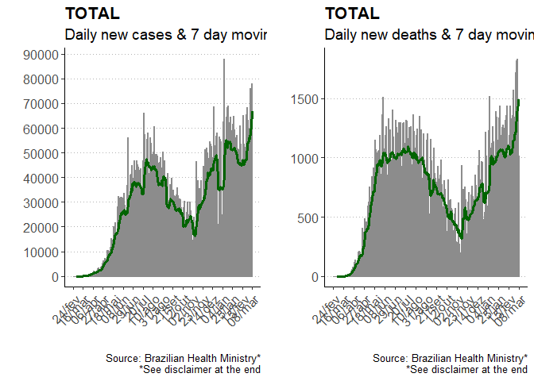
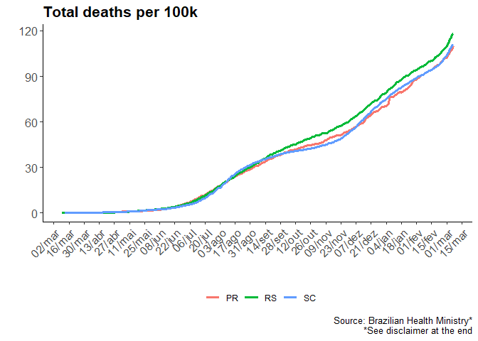
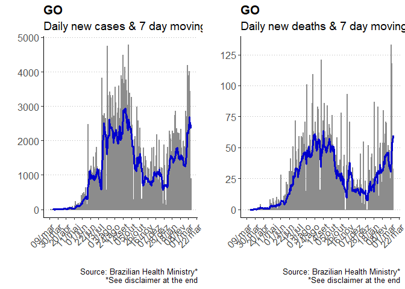
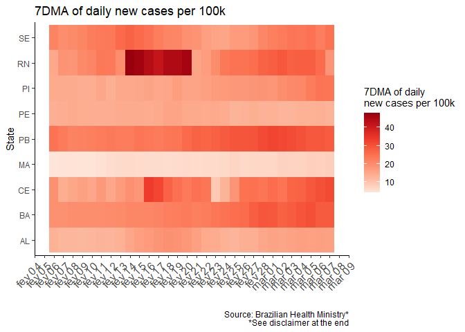
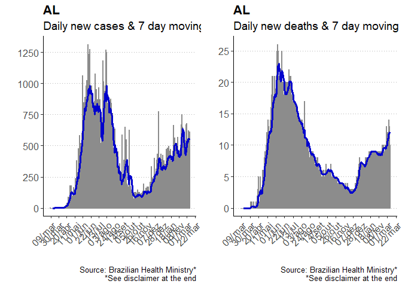
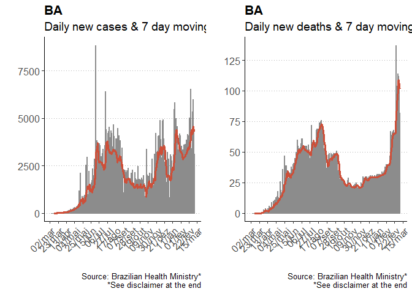
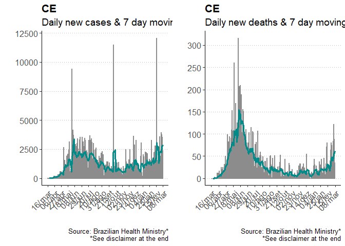
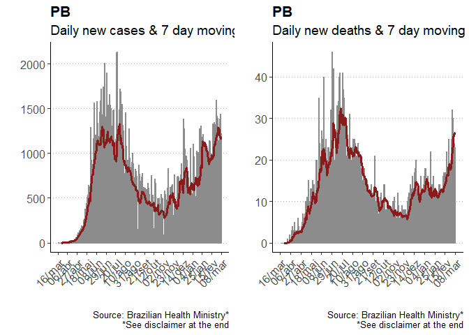
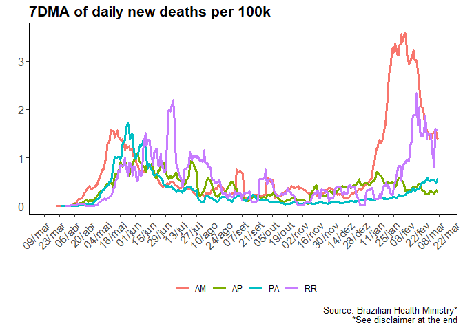
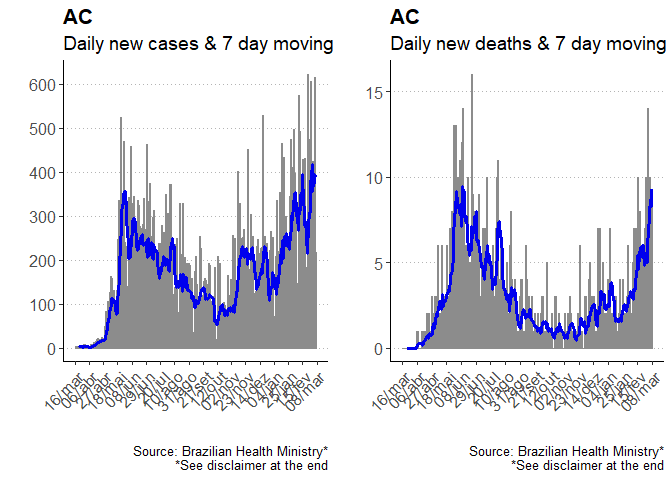

Covid BR
================
Mohammed Kaebi

  - [Brazil](#brazil)
      - [Map - New cases and deaths](#map---new-cases-and-deaths)
      - [Map - Total cases and deaths](#map---total-cases-and-deaths)
      - [Brazil (1)](#brazil-1)
      - [Brazil (2)](#brazil-2)
      - [Brazil (3)](#brazil-3)
      - [Brazil (4)](#brazil-4)
  - [Southeast](#southeast)
      - [New cases in the last 30 days](#new-cases-in-the-last-30-days)
      - [New deaths in the last 30
        days](#new-deaths-in-the-last-30-days)
      - [Southeast - New cases](#southeast---new-cases)
      - [Southeast - New deaths](#southeast---new-deaths)
      - [Southeast - Total cases](#southeast---total-cases)
      - [Southeast - Total Deaths](#southeast---total-deaths)
      - [São Paulo](#são-paulo)
      - [Rio de Janeiro](#rio-de-janeiro)
      - [Minas Gerais](#minas-gerais)
      - [Espírito Santo](#espírito-santo)
  - [South](#south)
      - [New cases in the last 30
        days](#new-cases-in-the-last-30-days-1)
      - [New deaths in the last 30
        days](#new-deaths-in-the-last-30-days-1)
      - [South - New cases](#south---new-cases)
      - [South - New deaths](#south---new-deaths)
      - [South - Total cases](#south---total-cases)
      - [South - Total deaths](#south---total-deaths)
      - [Santa Catarina](#santa-catarina)
      - [Paraná](#paraná)
      - [Rio Grande do Sul](#rio-grande-do-sul)
  - [Midwest](#midwest)
      - [New cases in the last 30
        days](#new-cases-in-the-last-30-days-2)
      - [New deaths in the last 30
        days](#new-deaths-in-the-last-30-days-2)
      - [Midwest - New cases](#midwest---new-cases)
      - [Midwest - New deaths](#midwest---new-deaths)
      - [Midwest - Total cases](#midwest---total-cases)
      - [Midwest - Total deaths](#midwest---total-deaths)
      - [Goiás](#goiás)
      - [Mato Grosso](#mato-grosso)
      - [Mato Grosso do Sul](#mato-grosso-do-sul)
      - [Distrito Federal](#distrito-federal)
  - [North East](#north-east)
      - [New cases in the last 30
        days](#new-cases-in-the-last-30-days-3)
      - [New deaths in the last 30
        days](#new-deaths-in-the-last-30-days-3)
      - [North East - New cases I](#north-east---new-cases-i)
      - [North East - New cases II](#north-east---new-cases-ii)
      - [North East - New deaths I](#north-east---new-deaths-i)
      - [North East - New deaths II](#north-east---new-deaths-ii)
      - [North East - Total cases I](#north-east---total-cases-i)
      - [North East - Total cases II](#north-east---total-cases-ii)
      - [North East - Total deaths I](#north-east---total-deaths-i)
      - [North East - Total deaths II](#north-east---total-deaths-ii)
      - [Alagoas](#alagoas)
      - [Bahia](#bahia)
      - [Ceará](#ceará)
      - [Maranhão](#maranhão)
      - [Paraíba](#paraíba)
      - [Pernambuco](#pernambuco)
      - [Piauí](#piauí)
      - [Rio Grande do Norte](#rio-grande-do-norte)
      - [Sergipe](#sergipe)
  - [North](#north)
      - [New cases in the last 30
        days](#new-cases-in-the-last-30-days-4)
      - [New deaths in the last 30
        days](#new-deaths-in-the-last-30-days-4)
      - [North - New cases I](#north---new-cases-i)
      - [North - New cases II](#north---new-cases-ii)
      - [North - New deaths I](#north---new-deaths-i)
      - [North - New deaths II](#north---new-deaths-ii)
      - [North - Total cases I](#north---total-cases-i)
      - [North - Total cases II](#north---total-cases-ii)
      - [North - Total deaths I](#north---total-deaths-i)
      - [North - Total deaths II](#north---total-deaths-ii)
      - [Amazonas](#amazonas)
      - [Roraima](#roraima)
      - [Amapá](#amapá)
      - [Pará](#pará)
      - [Tocantins](#tocantins)
      - [Rondônia](#rondônia)
      - [Acre](#acre)
  - [Data source](#data-source)
      - [Data source](#data-source-1)

R Code for collecting and plotting Covid-19 data for Brazil and
brazilian states.

``` r
knitr::opts_chunk$set(echo = TRUE)

library(tidyverse)
library(lubridate)
library(zoo)
library(data.table)
library(ggthemes)
library(ggrepel)
library(gridExtra)
library(abjData)


## Cases ----

db <-
  read.csv(
    "https://raw.githubusercontent.com/wcota/covid19br/master/cases-brazil-states.csv",
    stringsAsFactors = FALSE
  )

db$date <- as.Date(db$date)

db$newCases <- abs(db$newCases)
db$newDeaths <- abs(db$newDeaths)

total_df <- db %>% 
  group_by(state) %>% 
  mutate(cases_7dma = frollmean(newCases, 7),
         cases_14dma = frollmean(newCases, 14),
         ratio = newCases / cases_14dma,
         R = frollmean(ratio, 7),
         deaths_7dma = frollmean(newDeaths, 7),
         
         newCases_14daychg = newCases - lag(newCases, 14),
         newDeaths_14daychg = newDeaths - lag(newDeaths, 14),
         
         newCases_7dmachg = cases_7dma - lag(cases_7dma, 7),
         newDeaths_7dmachg = deaths_7dma - lag(deaths_7dma, 7),
         
         newCases_100k = totalCases_per_100k_inhabitants - lag(totalCases_per_100k_inhabitants),
         newCases_100k_7dma = frollmean(newCases_100k, 7),
         newCases_100k_14_daychg = newCases_100k - lag(newCases_100k, 14),
         
         newDeaths_100k = deaths_per_100k_inhabitants - lag(deaths_per_100k_inhabitants),
         newDeaths_100k_7dma = frollmean(newDeaths_100k, 7),
         newDeaths_100k_14_daychg = newDeaths_100k - lag(newDeaths_100k, 14))


graf_cases <- function(x, int, cor){
  filter(total_df, state == x) %>%
    ggplot() +
    geom_bar(aes(x = date, y = newCases), stat = "identity", color = "grey55", alpha = 0.6) +
    geom_line(aes(x = date, y = cases_7dma), color = cor, size = 1.3)+
    labs(
      title = paste0(x),
      subtitle = "Daily new cases & 7 day moving average",
      caption = "Source: Brazilian Health Ministry*\n*See disclaimer at the end",
      x = "",
      y = ""
    ) +
    scale_y_continuous(breaks = seq(0, max(total_df[total_df$state==x, 8], na.rm = T) + 10000, by = int))+
    scale_x_date(date_labels = "%d/%b", breaks = "3 weeks")+
    theme_classic() +
    theme(
      axis.title = element_text(size = 14),
      axis.text.x = element_text(size = 12, angle = 45, hjust = 1),
      axis.text.y = element_text(size = 12),
      plot.title = element_text(size = 16, face = "bold"),
      plot.subtitle = element_text(size = 14),
      plot.caption = element_text(size = 10),
      legend.position = "none",
      panel.grid.major.y = element_line(linetype = "dotted", color = "gray70")
    )
}

graf_deaths <- function(x, int, cor){
  filter(total_df, state == x) %>%
    ggplot() +
    geom_bar(aes(x = date, y = newDeaths), stat = "identity", color = "grey55", alpha = 0.6) +
    geom_line(aes(x = date, y = deaths_7dma), color = cor, size = 1.3)+
    labs(
      title = paste0(x),
      subtitle = "Daily new deaths & 7 day moving average",
      caption = "Source: Brazilian Health Ministry*\n*See disclaimer at the end",
      x = "",
      y = ""
    ) +
    scale_y_continuous(breaks = seq(0, max(total_df[total_df$state==x, 6], na.rm = T) + 10000, by = int))+
    scale_x_date(date_labels = "%d/%b", breaks = "3 weeks")+
    theme_classic() +
    theme(
      axis.title = element_text(size = 14),
      axis.text.x = element_text(size = 12, angle = 45, hjust = 1),
      axis.text.y = element_text(size = 12),
      plot.title = element_text(size = 16, face = "bold"),
      plot.subtitle = element_text(size = 14),
      plot.caption = element_text(size = 10),
      legend.position = "none",
      panel.grid.major.y = element_line(linetype = "dotted", color = "gray70")
    )
}
```

# Brazil

## Map - New cases and deaths

``` r
dataset <- br_uf_map # dados de lat e long para o Brazil e estados

total_map <- total_df[total_df$date == today()-1, ]
dataset <- left_join(dataset, total_map, by = c("id" = "state"))

g1 <- ggplot(data = dataset) +
  geom_map(
    aes(
      x = long,
      y = lat,
      map_id = id,
      fill = newCases_100k_7dma
    ),
    map = dataset,
    data = dataset,
    color = "gray"
  )+
  coord_equal()+
  scale_fill_distiller(palette = "Reds",
                       direction = 1)+
  labs(fill = "7DMA of daily new\ncases per 100k",
       title = paste("7DMA of daily new cases per 100k on", format(today() - 1, "%d-%b")),
       caption = "Source: Brazilian Health Ministry*\n*See disclaimer at the end")+
  theme_void()+
  theme(strip.background = element_blank(), legend.position = "bottom")


g2 <- ggplot(data = dataset) +
  geom_map(
    aes(
      x = long,
      y = lat,
      map_id = id,
      fill = newDeaths_100k_7dma
    ),
    map = dataset,
    data = dataset,
    color = "gray"
  )+
  coord_equal()+
  scale_fill_distiller(palette = "Reds",
                       direction = 1)+
  labs(fill = "7DMA of daily new\ndeaths per 100k",
       title = paste("7DMA of daily new deaths per 100k on", format(today() - 1, "%d-%b")),
       caption = "Source: Brazilian Health Ministry*\n*See disclaimer at the end")+
  theme_void()+
  theme(strip.background = element_blank(), legend.position = "bottom")

grid.arrange(g1, g2, nrow = 1)
```

<!-- -->

## Map - Total cases and deaths

``` r
dataset <- br_uf_map # dados de lat e long para o Brazil e estados

total_map <- total_df[total_df$date == today()-1, ]
dataset <- left_join(dataset, total_map, by = c("id" = "state"))

g1 <- ggplot(data = dataset) +
  geom_map(
    aes(
      x = long,
      y = lat,
      map_id = id,
      fill = totalCases_per_100k_inhabitants
    ),
    map = dataset,
    data = dataset,
    color = "gray"
  )+
  coord_equal()+
  scale_fill_distiller(palette = "Reds",
                       direction = 1)+
  labs(fill = "Total cases\nper 100k",
       title = paste("Total cases per 100k as of", format(today() - 1, "%d-%b")),
       caption = "Source: Brazilian Health Ministry*\n*See disclaimer at the end")+
  theme_void()+
  theme(strip.background = element_blank(), legend.position = "bottom")


g2 <- ggplot(data = dataset) +
  geom_map(
    aes(
      x = long,
      y = lat,
      map_id = id,
      fill = deaths_per_100k_inhabitants
    ),
    map = dataset,
    data = dataset,
    color = "gray"
  )+
  coord_equal()+
  scale_fill_distiller(palette = "Reds",
                       direction = 1)+
  labs(fill = "Total deaths\nper 100k",
       title = paste("Total deaths per 100k as of", format(today() - 1, "%d-%b")),
       caption = "Source: Brazilian Health Ministry*\n*See disclaimer at the end")+
  theme_void()+
  theme(strip.background = element_blank(), legend.position = "bottom")

grid.arrange(g1, g2, nrow = 1)
```

<!-- -->

## Brazil (1)

``` r
g1 <- ggplot(data = filter(total_df, state == "TOTAL")) +
  geom_bar(aes(x = date, y = newCases_100k), stat = "identity", color = "grey55", alpha = 0.6) +
  geom_line(
    mapping = aes(x = date, y = newCases_100k_7dma), 
    color = "darkgreen",
    size = 1.3
  ) +
  labs(
    title = "Brazil total daily new cases per 100k",
    caption = "Source: Brazilian Health Ministry*\n*See disclaimer at the end",
    x = "",
    y = ""
  ) +
  scale_y_continuous(breaks = seq(0, 40, by = 5)) +
  scale_x_date(date_labels = "%d/%b", breaks = "2 weeks") +
  theme_classic() +
  theme(
    axis.title = element_text(size = 12),
    axis.text = element_text(size = 12),
    axis.text.x = element_text(size = 12, angle = 45, hjust = 1),
    plot.title = element_text(size = 16, face = "bold"),
    plot.subtitle = element_text(size = 14),
    plot.caption = element_text(size = 10),
    legend.position = "none",
    legend.title=element_blank(),
    panel.grid.major.y = element_line(linetype = "dotted", color = "gray70")
  )

g2 <- ggplot(data = filter(total_df, state == "TOTAL")) +
  geom_bar(aes(x = date, y = newDeaths_100k), stat = "identity", color = "grey55", alpha = 0.6) +
  geom_line(
    mapping = aes(x = date, y = newDeaths_100k_7dma), 
    color = "darkgreen",
    size = 1.3
  ) +
  labs(
    title = "Brazil total daily new deaths per 100k",
    caption = "Source: Brazilian Health Ministry*\n*See disclaimer at the end",
    x = "",
    y = ""
  ) +
  #scale_y_continuous(breaks = seq(0, 40, by = 5)) +
  scale_x_date(date_labels = "%d/%b", breaks = "2 weeks") +
  theme_classic() +
  theme(
    axis.title = element_text(size = 12),
    axis.text = element_text(size = 12),
    axis.text.x = element_text(size = 12, angle = 45, hjust = 1),
    plot.title = element_text(size = 16, face = "bold"),
    plot.subtitle = element_text(size = 14),
    plot.caption = element_text(size = 10),
    legend.position = "none",
    legend.title=element_blank(),
    panel.grid.major.y = element_line(linetype = "dotted", color = "gray70")
  )

grid.arrange(g1, g2, nrow = 1)
```

<!-- -->

## Brazil (2)

``` r
g1 <- graf_cases("TOTAL", 10000, "darkgreen")
g2 <- graf_deaths("TOTAL", 500, "darkgreen")
grid.arrange(g1, g2, nrow = 1)
```

<!-- -->

## Brazil (3)

``` r
sudeste <- c("RJ", "SP", "MG", "ES")
centro <- c("GO", "MT", "MS", "DF")
sul <- c("SC", "RS", "PR")
nord <- c("MA", "PI", "CE", "RN", "PB", "PE", "AL", "SE", "BA")
norte <- c("AM", "RR", "AP", "PA", "TO", "RO", "AC")

total_df %>%
  filter(date > as.Date(today() - 15), state != "TOTAL") %>%
  mutate(region = case_when(state %in% sudeste ~ "Sudeste",
                            state %in% centro ~ "Centro-Oeste",
                            state %in% sul ~ "Sul",
                            state %in% nord ~ "Nordeste",
                            state %in% norte ~ "Norte")) %>% 
  ggplot(aes(x = date, y = state, fill = newCases_100k_7dma))+
  geom_tile()+
  facet_wrap(~ region, scales = "free_y")+
  scale_fill_distiller(name = "7DMA of daily\nnew cases per 100k",
                       palette = "Reds",
                       direction = 1)+
  scale_x_date(date_labels = "%b %d", breaks = "1 day")+
  labs(
      title = "7DMA of daily new cases per 100k",
      caption = "Source: Brazilian Health Ministry*\n*See disclaimer at the end",
      x = "",
      y = "State"
    )+
  theme_classic()+
  theme(
      axis.text.x = element_text(size = 8, angle = 45, hjust = 1),
      legend.position = "bottom"
    )
```

<!-- -->

## Brazil (4)

``` r
sudeste <- c("RJ", "SP", "MG", "ES")
centro <- c("GO", "MT", "MS", "DF")
sul <- c("SC", "RS", "PR")
nord <- c("MA", "PI", "CE", "RN", "PB", "PE", "AL", "SE", "BA")
norte <- c("AM", "RR", "AP", "PA", "TO", "RO", "AC")

total_df %>%
  filter(date > as.Date(today() - 15), state != "TOTAL") %>%
  mutate(region = case_when(state %in% sudeste ~ "Sudeste",
                            state %in% centro ~ "Centro-Oeste",
                            state %in% sul ~ "Sul",
                            state %in% nord ~ "Nordeste",
                            state %in% norte ~ "Norte")) %>% 
  ggplot(aes(x = date, y = state, fill = newDeaths_100k_7dma))+
  geom_tile()+
  facet_wrap(~ region, scales = "free_y")+
  scale_fill_distiller(name = "7DMA of daily\nnew deaths per 100k",
                       palette = "Reds",
                       direction = 1)+
  scale_x_date(date_labels = "%b %d", breaks = "1 day")+
  labs(
      title = "7DMA of daily new deaths per 100k",
      caption = "Source: Brazilian Health Ministry*\n*See disclaimer at the end",
      x = "",
      y = "State"
    )+
  theme_classic()+
  theme(
      axis.text.x = element_text(size = 8, angle = 45, hjust = 1),
      legend.position = "bottom"
    )
```

<!-- -->

# Southeast

## New cases in the last 30 days

``` r
sudeste <- c("RJ", "SP", "MG", "ES")
total_df %>% 
  filter(date > as.Date(today() - 30), state %in% sudeste) %>% 
  ggplot(aes(x = date, y = state, fill = newCases_100k_7dma))+
  geom_tile()+
  scale_fill_distiller(name = "7DMA of daily\nnew cases per 100k",
                       palette = "Reds",
                       direction = 1)+
  scale_x_date(date_labels = "%b %d", breaks = "1 day")+
  labs(
      title = "7DMA of daily new cases per 100k",
      caption = "Source: Brazilian Health Ministry*\n*See disclaimer at the end",
      x = "",
      y = "State"
    )+
  theme_classic()+
  theme(
      axis.text.x = element_text(size = 12, angle = 45, hjust = 1)
    )
```

<!-- -->

## New deaths in the last 30 days

``` r
sudeste <- c("RJ", "SP", "MG", "ES")
total_df %>% 
  filter(date > as.Date(today() - 30), state %in% sudeste) %>% 
  ggplot(aes(x = date, y = state, fill = newDeaths_100k_7dma))+
  geom_tile()+
  scale_fill_distiller(name = "7DMA of daily new\ndeaths per 100k",
                       palette = "Reds",
                       direction = 1)+
  scale_x_date(date_labels = "%b %d", breaks = "1 day")+
  labs(
      title = "7DMA of daily new deaths per 100k",
      caption = "Source: Brazilian Health Ministry*\n*See disclaimer at the end",
      x = "",
      y = "State"
    )+
  theme_classic()+
  theme(
      axis.text.x = element_text(size = 12, angle = 45, hjust = 1)
    )
```

<!-- -->

## Southeast - New cases

``` r
sudeste <- c("RJ", "SP", "MG", "ES")

ggplot(data = filter(total_df, state %in% sudeste)) +
  geom_line(
    mapping = aes(x = date, y = newCases_100k_7dma, color = state),
    size = 1.3
  ) +
  labs(
    title = "7DMA of daily new cases per 100k",
    caption = "Source: Brazilian Health Ministry*\n*See disclaimer at the end",
    x = "",
    y = ""
  ) +
  scale_y_continuous(breaks = seq(0, 200, by = 5)) +
  scale_x_date(date_labels = "%d/%b", breaks = "2 weeks") +
  theme_classic() +
  theme(
    axis.title = element_text(size = 12),
    axis.text = element_text(size = 12),
    axis.text.x = element_text(size = 12, angle = 45, hjust = 1),
    plot.title = element_text(size = 16, face = "bold"),
    plot.subtitle = element_text(size = 14),
    plot.caption = element_text(size = 10),
    legend.position = "bottom",
    legend.title=element_blank()
  )
```

<!-- -->

## Southeast - New deaths

``` r
sudeste <- c("RJ", "SP", "MG", "ES")

ggplot(data = filter(total_df, state %in% sudeste)) +
  geom_line(
    mapping = aes(x = date, y = newDeaths_100k_7dma, color = state),
    size = 1.3
  ) +
  labs(
    title = "7DMA of daily new deaths per 100k",
    caption = "Source: Brazilian Health Ministry*\n*See disclaimer at the end",
    x = "",
    y = ""
  ) +
  #scale_y_continuous(breaks = seq(0, 10, by = 5)) +
  scale_x_date(date_labels = "%d/%b", breaks = "2 weeks") +
  theme_classic() +
  theme(
    axis.title = element_text(size = 12),
    axis.text = element_text(size = 12),
    axis.text.x = element_text(size = 12, angle = 45, hjust = 1),
    plot.title = element_text(size = 16, face = "bold"),
    plot.subtitle = element_text(size = 14),
    plot.caption = element_text(size = 10),
    legend.position = "bottom",
    legend.title=element_blank()
  )
```

<!-- -->

## Southeast - Total cases

``` r
sudeste <- c("RJ", "SP", "MG", "ES")

ggplot(data = filter(total_df, state %in% sudeste)) +
  geom_line(
    mapping = aes(x = date, y = totalCases_per_100k_inhabitants, color = state),
    size = 1.3
  ) +
  labs(
    title = "Total cases per 100k",
    caption = "Source: Brazilian Health Ministry*\n*See disclaimer at the end",
    x = "",
    y = ""
  ) +
  #scale_y_continuous(breaks = seq(0, 50, by = 100)) +
  scale_x_date(date_labels = "%d/%b", breaks = "2 weeks") +
  theme_classic() +
  theme(
    axis.title = element_text(size = 12),
    axis.text = element_text(size = 12),
    axis.text.x = element_text(size = 12, angle = 45, hjust = 1),
    plot.title = element_text(size = 16, face = "bold"),
    plot.subtitle = element_text(size = 14),
    plot.caption = element_text(size = 10),
    legend.position = "bottom",
    legend.title=element_blank()
  )
```

<!-- -->

## Southeast - Total Deaths

``` r
sudeste <- c("RJ", "SP", "MG", "ES")

ggplot(data = filter(total_df, state %in% sudeste)) +
  geom_line(
    mapping = aes(x = date, y = deaths_per_100k_inhabitants, color = state),
    size = 1.3
  ) +
  labs(
    title = "Total deaths per 100k",
    caption = "Source: Brazilian Health Ministry*\n*See disclaimer at the end",
    x = "",
    y = ""
  ) +
  #scale_y_continuous(breaks = seq(0, 40, by = 5)) +
  scale_x_date(date_labels = "%d/%b", breaks = "2 weeks") +
  theme_classic() +
  theme(
    axis.title = element_text(size = 12),
    axis.text = element_text(size = 12),
    axis.text.x = element_text(size = 12, angle = 45, hjust = 1),
    plot.title = element_text(size = 16, face = "bold"),
    plot.subtitle = element_text(size = 14),
    plot.caption = element_text(size = 10),
    legend.position = "bottom",
    legend.title=element_blank()
  )
```

<!-- -->

## São Paulo

``` r
g1 <- graf_cases("SP", 5000, "blue3")
g2 <- graf_deaths("SP", 100, "blue3")
grid.arrange(g1, g2, nrow = 1)
```

<!-- -->

## Rio de Janeiro

``` r
g1 <- graf_cases("RJ", 1000, "tomato3")
g2 <- graf_deaths("RJ", 100, "tomato3")
grid.arrange(g1, g2, nrow = 1)
```

<!-- -->

## Minas Gerais

``` r
g1 <- graf_cases("MG", 1000, "forestgreen")
g2 <- graf_deaths("MG", 25, "forestgreen")
grid.arrange(g1, g2, nrow = 1)
```

<!-- -->

## Espírito Santo

``` r
g1 <- graf_cases("ES", 500, "indianred4")
g2 <- graf_deaths("ES", 10, "indianred4")
grid.arrange(g1, g2, nrow = 1)
```

<!-- -->

# South

## New cases in the last 30 days

``` r
sul <- c("SC", "RS", "PR")
total_df %>% 
  filter(date > as.Date(today() - 30), state %in% sul) %>% 
  ggplot(aes(x = date, y = state, fill = newCases_100k_7dma))+
  geom_tile()+
  scale_fill_distiller(name = "7DMA of daily\nnew cases per 100k",
                       palette = "Reds",
                       direction = 1)+
  scale_x_date(date_labels = "%b %d", breaks = "1 day")+
  labs(
      title = "7DMA of daily new cases per 100k",
      caption = "Source: Brazilian Health Ministry*\n*See disclaimer at the end",
      x = "",
      y = "State"
    )+
  theme_classic()+
  theme(
      axis.text.x = element_text(size = 12, angle = 45, hjust = 1)
    )
```

<!-- -->

## New deaths in the last 30 days

``` r
sul <- c("SC", "RS", "PR")
total_df %>% 
  filter(date > as.Date(today() - 30), state %in% sul) %>% 
  ggplot(aes(x = date, y = state, fill = newDeaths_100k_7dma))+
  geom_tile()+
  scale_fill_distiller(name = "7DMA of daily new\ndeaths per 100k",
                       palette = "Reds",
                       direction = 1)+
  scale_x_date(date_labels = "%b %d", breaks = "1 day")+
  labs(
      title = "7DMA of daily new deaths per 100k",
      caption = "Source: Brazilian Health Ministry*\n*See disclaimer at the end",
      x = "",
      y = "State"
    )+
  theme_classic()+
  theme(
      axis.text.x = element_text(size = 12, angle = 45, hjust = 1)
    )
```

<!-- -->

## South - New cases

``` r
sul <- c("SC", "RS", "PR")

ggplot(data = filter(total_df, state %in% sul)) +
  geom_line(
    mapping = aes(x = date, y = newCases_100k_7dma, color = state),
    size = 1.3
  ) +
  labs(
    title = "7DMA of daily new cases per 100k",
    caption = "Source: Brazilian Health Ministry*\n*See disclaimer at the end",
    x = "",
    y = ""
  ) +
  scale_y_continuous(breaks = seq(0, 100, by = 10)) +
  scale_x_date(date_labels = "%d/%b", breaks = "2 weeks") +
  theme_classic() +
  theme(
    axis.title = element_text(size = 12),
    axis.text = element_text(size = 12),
    axis.text.x = element_text(size = 12, angle = 45, hjust = 1),
    plot.title = element_text(size = 16, face = "bold"),
    plot.subtitle = element_text(size = 14),
    plot.caption = element_text(size = 10),
    legend.position = "bottom",
    legend.title=element_blank()
  )
```

<!-- -->

## South - New deaths

``` r
sul <- c("SC", "RS", "PR")

ggplot(data = filter(total_df, state %in% sul)) +
  geom_line(
    mapping = aes(x = date, y = newDeaths_100k_7dma, color = state),
    size = 1.3
  ) +
  labs(
    title = "7DMA of daily new deaths per 100k",
    caption = "Source: Brazilian Health Ministry*\n*See disclaimer at the end",
    x = "",
    y = ""
  ) +
  #scale_y_continuous(breaks = seq(0, 10, by = 5)) +
  scale_x_date(date_labels = "%d/%b", breaks = "2 weeks") +
  theme_classic() +
  theme(
    axis.title = element_text(size = 12),
    axis.text = element_text(size = 12),
    axis.text.x = element_text(size = 12, angle = 45, hjust = 1),
    plot.title = element_text(size = 16, face = "bold"),
    plot.subtitle = element_text(size = 14),
    plot.caption = element_text(size = 10),
    legend.position = "bottom",
    legend.title=element_blank()
  )
```

<!-- -->

## South - Total cases

``` r
sul <- c("SC", "RS", "PR")

ggplot(data = filter(total_df, state %in% sul)) +
  geom_line(
    mapping = aes(x = date, y = totalCases_per_100k_inhabitants, color = state),
    size = 1.3
  ) +
  labs(
    title = "Total cases per 100k",
    caption = "Source: Brazilian Health Ministry*\n*See disclaimer at the end",
    x = "",
    y = ""
  ) +
  #scale_y_continuous(breaks = seq(0, 10, by = 5)) +
  scale_x_date(date_labels = "%d/%b", breaks = "2 weeks") +
  theme_classic() +
  theme(
    axis.title = element_text(size = 12),
    axis.text = element_text(size = 12),
    axis.text.x = element_text(size = 12, angle = 45, hjust = 1),
    plot.title = element_text(size = 16, face = "bold"),
    plot.subtitle = element_text(size = 14),
    plot.caption = element_text(size = 10),
    legend.position = "bottom",
    legend.title=element_blank()
  )
```

<!-- -->

## South - Total deaths

``` r
sul <- c("SC", "RS", "PR")

ggplot(data = filter(total_df, state %in% sul)) +
  geom_line(
    mapping = aes(x = date, y = deaths_per_100k_inhabitants, color = state),
    size = 1.3
  ) +
  labs(
    title = "Total deaths per 100k",
    caption = "Source: Brazilian Health Ministry*\n*See disclaimer at the end",
    x = "",
    y = ""
  ) +
  #scale_y_continuous(breaks = seq(0, 10, by = 5)) +
  scale_x_date(date_labels = "%d/%b", breaks = "2 weeks") +
  theme_classic() +
  theme(
    axis.title = element_text(size = 12),
    axis.text = element_text(size = 12),
    axis.text.x = element_text(size = 12, angle = 45, hjust = 1),
    plot.title = element_text(size = 16, face = "bold"),
    plot.subtitle = element_text(size = 14),
    plot.caption = element_text(size = 10),
    legend.position = "bottom",
    legend.title=element_blank()
  )
```

<!-- -->

## Santa Catarina

``` r
g1 <- graf_cases("SC", 5000, "blue3")
g2 <- graf_deaths("SC", 25, "blue3")
grid.arrange(g1, g2, nrow = 1)
```

<!-- -->

## Paraná

``` r
g1 <- graf_cases("PR", 5000, "tomato3")
g2 <- graf_deaths("PR", 50, "tomato3")
grid.arrange(g1, g2, nrow = 1)
```

<!-- -->

## Rio Grande do Sul

``` r
g1 <- graf_cases("RS", 1000, "forestgreen")
g2 <- graf_deaths("RS", 25, "forestgreen")
grid.arrange(g1, g2, nrow = 1)
```

<!-- -->

# Midwest

## New cases in the last 30 days

``` r
centro <- c("GO", "MT", "MS", "DF")
total_df %>% 
  filter(date > as.Date(today() - 30), state %in% centro) %>% 
  ggplot(aes(x = date, y = state, fill = newCases_100k_7dma))+
  geom_tile()+
  scale_fill_distiller(name = "7DMA of daily\nnew cases per 100k",
                       palette = "Reds",
                       direction = 1)+
  scale_x_date(date_labels = "%b %d", breaks = "1 day")+
  labs(
      title = "7DMA of daily new cases per 100k",
      caption = "Source: Brazilian Health Ministry*\n*See disclaimer at the end",
      x = "",
      y = "State"
    )+
  theme_classic()+
  theme(
      axis.text.x = element_text(size = 12, angle = 45, hjust = 1)
    )
```

<!-- -->

## New deaths in the last 30 days

``` r
centro <- c("GO", "MT", "MS", "DF")
total_df %>% 
  filter(date > as.Date(today() - 30), state %in% centro) %>% 
  ggplot(aes(x = date, y = state, fill = newDeaths_100k_7dma))+
  geom_tile()+
  scale_fill_distiller(name = "7DMA of daily new\ndeaths per 100k",
                       palette = "Reds",
                       direction = 1)+
  scale_x_date(date_labels = "%b %d", breaks = "1 day")+
  labs(
      title = "7DMA of daily new deaths per 100k",
      caption = "Source: Brazilian Health Ministry*\n*See disclaimer at the end",
      x = "",
      y = "State"
    )+
  theme_classic()+
  theme(
      axis.text.x = element_text(size = 12, angle = 45, hjust = 1)
    )
```

<!-- -->

## Midwest - New cases

``` r
centro <- c("GO", "MT", "MS", "DF")
ggplot(data = filter(total_df, state %in% centro)) +
  geom_line(
    mapping = aes(x = date, y = newCases_100k_7dma, color = state),
    size = 1.3
  ) +
  labs(
    title = "7DMA of daily new cases per 100k",
    caption = "Source: Brazilian Health Ministry*\n*See disclaimer at the end",
    x = "",
    y = ""
  ) +
  scale_y_continuous(breaks = seq(0, 100, by = 10)) +
  scale_x_date(date_labels = "%d/%b", breaks = "2 weeks") +
  theme_classic() +
  theme(
    axis.title = element_text(size = 12),
    axis.text = element_text(size = 12),
    axis.text.x = element_text(size = 12, angle = 45, hjust = 1),
    plot.title = element_text(size = 16, face = "bold"),
    plot.subtitle = element_text(size = 14),
    plot.caption = element_text(size = 10),
    legend.position = "bottom",
    legend.title=element_blank()
  )
```

<!-- -->

## Midwest - New deaths

``` r
centro <- c("GO", "MT", "MS", "DF")

ggplot(data = filter(total_df, state %in% centro)) +
  geom_line(
    mapping = aes(x = date, y = newDeaths_100k_7dma, color = state),
    size = 1.3
  ) +
  labs(
    title = "7DMA of daily new deaths per 100k",
    caption = "Source: Brazilian Health Ministry*\n*See disclaimer at the end",
    x = "",
    y = ""
  ) +
  #scale_y_continuous(breaks = seq(0, 10, by = 5)) +
  scale_x_date(date_labels = "%d/%b", breaks = "2 weeks") +
  theme_classic() +
  theme(
    axis.title = element_text(size = 12),
    axis.text = element_text(size = 12),
    axis.text.x = element_text(size = 12, angle = 45, hjust = 1),
    plot.title = element_text(size = 16, face = "bold"),
    plot.subtitle = element_text(size = 14),
    plot.caption = element_text(size = 10),
    legend.position = "bottom",
    legend.title=element_blank()
  )
```

<!-- -->

## Midwest - Total cases

``` r
centro <- c("GO", "MT", "MS", "DF")
ggplot(data = filter(total_df, state %in% centro)) +
  geom_line(
    mapping = aes(x = date, y = totalCases_per_100k_inhabitants, color = state),
    size = 1.3
  ) +
  labs(
    title = "Total cases per 100k",
    caption = "Source: Brazilian Health Ministry*\n*See disclaimer at the end",
    x = "",
    y = ""
  ) +
  #scale_y_continuous(breaks = seq(0, 100, by = 10)) +
  scale_x_date(date_labels = "%d/%b", breaks = "2 weeks") +
  theme_classic() +
  theme(
    axis.title = element_text(size = 12),
    axis.text = element_text(size = 12),
    axis.text.x = element_text(size = 12, angle = 45, hjust = 1),
    plot.title = element_text(size = 16, face = "bold"),
    plot.subtitle = element_text(size = 14),
    plot.caption = element_text(size = 10),
    legend.position = "bottom",
    legend.title=element_blank()
  )
```

<!-- -->

## Midwest - Total deaths

``` r
centro <- c("GO", "MT", "MS", "DF")
ggplot(data = filter(total_df, state %in% centro)) +
  geom_line(
    mapping = aes(x = date, y = deaths_per_100k_inhabitants, color = state),
    size = 1.3
  ) +
  labs(
    title = "Total deaths per 100k",
    caption = "Source: Brazilian Health Ministry*\n*See disclaimer at the end",
    x = "",
    y = ""
  ) +
  #scale_y_continuous(breaks = seq(0, 100, by = 10)) +
  scale_x_date(date_labels = "%d/%b", breaks = "2 weeks") +
  theme_classic() +
  theme(
    axis.title = element_text(size = 12),
    axis.text = element_text(size = 12),
    axis.text.x = element_text(size = 12, angle = 45, hjust = 1),
    plot.title = element_text(size = 16, face = "bold"),
    plot.subtitle = element_text(size = 14),
    plot.caption = element_text(size = 10),
    legend.position = "bottom",
    legend.title=element_blank()
  )
```

<!-- -->

## Goiás

``` r
g1 <- graf_cases("GO", 1000, "blue3")
g2 <- graf_deaths("GO", 25, "blue3")
grid.arrange(g1, g2, nrow = 1)
```

<!-- -->

## Mato Grosso

``` r
g1 <- graf_cases("MT", 500, "tomato3")
g2 <- graf_deaths("MT", 25, "tomato3")
grid.arrange(g1, g2, nrow = 1)
```

<!-- -->

## Mato Grosso do Sul

``` r
g1 <- graf_cases("MS", 500, "forestgreen")
g2 <- graf_deaths("MS", 5, "forestgreen")
grid.arrange(g1, g2, nrow = 1)
```

<!-- -->

## Distrito Federal

``` r
g1 <- graf_cases("DF", 500, "cyan4")
g2 <- graf_deaths("DF", 10, "cyan4")
grid.arrange(g1, g2, nrow = 1)
```

<!-- -->

# North East

## New cases in the last 30 days

``` r
nord <- c("MA", "PI", "CE", "RN", "PB", "PE", "AL", "SE", "BA")
total_df %>% 
  filter(date > as.Date(today()-30), state %in% nord) %>% 
  ggplot(aes(x = date, y = state, fill = newCases_100k_7dma))+
  geom_tile()+
  scale_fill_distiller(name = "7DMA of daily\nnew cases per 100k",
                       palette = "Reds",
                       direction = 1)+
  scale_x_date(date_labels = "%b %d", breaks = "1 day")+
  labs(
    title = "7DMA of daily new cases per 100k",
    caption = "Source: Brazilian Health Ministry*\n*See disclaimer at the end",
    x = "",
    y = "State"
  )+
  theme_classic()+
  theme(
    axis.text.x = element_text(size = 12, angle = 45, hjust = 1)
  )
```

<!-- -->

## New deaths in the last 30 days

``` r
nord <- c("MA", "PI", "CE", "RN", "PB", "PE", "AL", "SE", "BA")
total_df %>% 
  filter(date > as.Date(today()-30), state %in% nord) %>% 
  ggplot(aes(x = date, y = state, fill = newDeaths_100k_7dma))+
  geom_tile()+
  scale_fill_distiller(name = "7DMA of daily new\ndeaths per 100k",
                       palette = "Reds",
                       direction = 1)+
  scale_x_date(date_labels = "%b %d", breaks = "1 day")+
  labs(
    title = "7DMA of daily new deaths per 100k",
    caption = "Source: Brazilian Health Ministry*\n*See disclaimer at the end",
    x = "",
    y = "State"
  )+
  theme_classic()+
  theme(
    axis.text.x = element_text(size = 12, angle = 45, hjust = 1)
  )
```

<!-- -->

## North East - New cases I

``` r
nord <- c("MA", "PI", "CE", "RN")
ggplot(data = filter(total_df, state %in% nord)) +
  geom_line(
    mapping = aes(x = date, y = newCases_100k_7dma, color = state),
    size = 1.3
  ) +
  labs(
    title = "7DMA of daily new cases per 100k",
    caption = "Source: Brazilian Health Ministry*\n*See disclaimer at the end",
    x = "",
    y = ""
  ) +
  scale_y_continuous(breaks = seq(0, 100, by = 10)) +
  scale_x_date(date_labels = "%d/%b", breaks = "2 weeks") +
  theme_classic() +
  theme(
    axis.title = element_text(size = 12),
    axis.text = element_text(size = 12),
    axis.text.x = element_text(size = 12, angle = 45, hjust = 1),
    plot.title = element_text(size = 16, face = "bold"),
    plot.subtitle = element_text(size = 14),
    plot.caption = element_text(size = 10),
    legend.position = "bottom",
    legend.title=element_blank()
  )
```

<!-- -->

## North East - New cases II

``` r
nord <- c("PB", "PE", "AL", "SE", "BA")
ggplot(data = filter(total_df, state %in% nord)) +
  geom_line(
    mapping = aes(x = date, y = newCases_100k_7dma, color = state),
    size = 1.3
  ) +
  labs(
    title = "7DMA of daily new cases per 100k",
    caption = "Source: Brazilian Health Ministry*\n*See disclaimer at the end",
    x = "",
    y = ""
  ) +
  scale_y_continuous(breaks = seq(0, 100, by = 10)) +
  scale_x_date(date_labels = "%d/%b", breaks = "2 weeks") +
  theme_classic() +
  theme(
    axis.title = element_text(size = 12),
    axis.text = element_text(size = 12),
    axis.text.x = element_text(size = 12, angle = 45, hjust = 1),
    plot.title = element_text(size = 16, face = "bold"),
    plot.subtitle = element_text(size = 14),
    plot.caption = element_text(size = 10),
    legend.position = "bottom",
    legend.title=element_blank()
  )
```

<!-- -->

## North East - New deaths I

``` r
nord <- c("MA", "PI", "CE", "RN")

ggplot(data = filter(total_df, state %in% nord)) +
  geom_line(
    mapping = aes(x = date, y = newDeaths_100k_7dma, color = state),
    size = 1.3
  ) +
  labs(
    title = "7DMA of daily new deaths per 100k",
    caption = "Source: Brazilian Health Ministry*\n*See disclaimer at the end",
    x = "",
    y = ""
  ) +
  #scale_y_continuous(breaks = seq(0, 10, by = 5)) +
  scale_x_date(date_labels = "%d/%b", breaks = "2 weeks") +
  theme_classic() +
  theme(
    axis.title = element_text(size = 12),
    axis.text = element_text(size = 12),
    axis.text.x = element_text(size = 12, angle = 45, hjust = 1),
    plot.title = element_text(size = 16, face = "bold"),
    plot.subtitle = element_text(size = 14),
    plot.caption = element_text(size = 10),
    legend.position = "bottom",
    legend.title=element_blank()
  )
```

<!-- -->

## North East - New deaths II

``` r
nord <- c("PB", "PE", "AL", "SE", "BA")

ggplot(data = filter(total_df, state %in% nord)) +
  geom_line(
    mapping = aes(x = date, y = newDeaths_100k_7dma, color = state),
    size = 1.3
  ) +
  labs(
    title = "7DMA of daily new deaths per 100k",
    caption = "Source: Brazilian Health Ministry*\n*See disclaimer at the end",
    x = "",
    y = ""
  ) +
  #scale_y_continuous(breaks = seq(0, 10, by = 5)) +
  scale_x_date(date_labels = "%d/%b", breaks = "2 weeks") +
  theme_classic() +
  theme(
    axis.title = element_text(size = 12),
    axis.text = element_text(size = 12),
    axis.text.x = element_text(size = 12, angle = 45, hjust = 1),
    plot.title = element_text(size = 16, face = "bold"),
    plot.subtitle = element_text(size = 14),
    plot.caption = element_text(size = 10),
    legend.position = "bottom",
    legend.title=element_blank()
  )
```

<!-- -->

## North East - Total cases I

``` r
nord <- c("MA", "PI", "CE", "RN")
ggplot(data = filter(total_df, state %in% nord)) +
  geom_line(
    mapping = aes(x = date, y = totalCases_per_100k_inhabitants, color = state),
    size = 1.3
  ) +
  labs(
    title = "Total cases per 100k",
    caption = "Source: Brazilian Health Ministry*\n*See disclaimer at the end",
    x = "",
    y = ""
  ) +
  #scale_y_continuous(breaks = seq(0, 100, by = 10)) +
  scale_x_date(date_labels = "%d/%b", breaks = "2 weeks") +
  theme_classic() +
  theme(
    axis.title = element_text(size = 12),
    axis.text = element_text(size = 12),
    axis.text.x = element_text(size = 12, angle = 45, hjust = 1),
    plot.title = element_text(size = 16, face = "bold"),
    plot.subtitle = element_text(size = 14),
    plot.caption = element_text(size = 10),
    legend.position = "bottom",
    legend.title=element_blank()
  )
```

<!-- -->

## North East - Total cases II

``` r
nord <- c("PB", "PE", "AL", "SE", "BA")
ggplot(data = filter(total_df, state %in% nord)) +
  geom_line(
    mapping = aes(x = date, y = totalCases_per_100k_inhabitants, color = state),
    size = 1.3
  ) +
  labs(
    title = "Total cases per 100k",
    caption = "Source: Brazilian Health Ministry*\n*See disclaimer at the end",
    x = "",
    y = ""
  ) +
  #scale_y_continuous(breaks = seq(0, 100, by = 10)) +
  scale_x_date(date_labels = "%d/%b", breaks = "2 weeks") +
  theme_classic() +
  theme(
    axis.title = element_text(size = 12),
    axis.text = element_text(size = 12),
    axis.text.x = element_text(size = 12, angle = 45, hjust = 1),
    plot.title = element_text(size = 16, face = "bold"),
    plot.subtitle = element_text(size = 14),
    plot.caption = element_text(size = 10),
    legend.position = "bottom",
    legend.title=element_blank()
  )
```

<!-- -->

## North East - Total deaths I

``` r
nord <- c("MA", "PI", "CE", "RN")

ggplot(data = filter(total_df, state %in% nord)) +
  geom_line(
    mapping = aes(x = date, y = deaths_per_100k_inhabitants, color = state),
    size = 1.3
  ) +
  labs(
    title = "Total deaths per 100k",
    caption = "Source: Brazilian Health Ministry*\n*See disclaimer at the end",
    x = "",
    y = ""
  ) +
  #scale_y_continuous(breaks = seq(0, 10, by = 5)) +
  scale_x_date(date_labels = "%d/%b", breaks = "2 weeks") +
  theme_classic() +
  theme(
    axis.title = element_text(size = 12),
    axis.text = element_text(size = 12),
    axis.text.x = element_text(size = 12, angle = 45, hjust = 1),
    plot.title = element_text(size = 16, face = "bold"),
    plot.subtitle = element_text(size = 14),
    plot.caption = element_text(size = 10),
    legend.position = "bottom",
    legend.title=element_blank()
  )
```

<!-- -->

## North East - Total deaths II

``` r
nord <- c("PB", "PE", "AL", "SE", "BA")

ggplot(data = filter(total_df, state %in% nord)) +
  geom_line(
    mapping = aes(x = date, y = deaths_per_100k_inhabitants, color = state),
    size = 1.3
  ) +
  labs(
    title = "7DMA of daily new deaths per 100k",
    caption = "Source: Brazilian Health Ministry*\n*See disclaimer at the end",
    x = "",
    y = ""
  ) +
  #scale_y_continuous(breaks = seq(0, 10, by = 5)) +
  scale_x_date(date_labels = "%d/%b", breaks = "2 weeks") +
  theme_classic() +
  theme(
    axis.title = element_text(size = 12),
    axis.text = element_text(size = 12),
    axis.text.x = element_text(size = 12, angle = 45, hjust = 1),
    plot.title = element_text(size = 16, face = "bold"),
    plot.subtitle = element_text(size = 14),
    plot.caption = element_text(size = 10),
    legend.position = "bottom",
    legend.title=element_blank()
  )
```

<!-- -->

## Alagoas

``` r
g1 <- graf_cases("AL", 250, "blue3")
g2 <- graf_deaths("AL", 5, "blue3")
grid.arrange(g1, g2, nrow = 1)
```

<!-- -->

## Bahia

``` r
g1 <- graf_cases("BA", 2500, "tomato3")
g2 <- graf_deaths("BA", 25, "tomato3")
grid.arrange(g1, g2, nrow = 1)
```

<!-- -->

## Ceará

``` r
g1 <- graf_cases("CE", 2500, "cyan4")
g2 <- graf_deaths("CE", 50, "cyan4")
grid.arrange(g1, g2, nrow = 1)
```

<!-- -->

## Maranhão

``` r
g1 <- graf_cases("MA", 500, "yellow4")
g2 <- graf_deaths("MA", 10, "yellow4")
grid.arrange(g1, g2, nrow = 1)
```

<!-- -->

## Paraíba

``` r
g1 <- graf_cases("PB", 500, "firebrick4")
g2 <- graf_deaths("PB", 10, "firebrick4")
grid.arrange(g1, g2, nrow = 1)
```

<!-- -->

## Pernambuco

``` r
g1 <- graf_cases("PE", 500, "black")
g2 <- graf_deaths("PE", 25, "black")
grid.arrange(g1, g2, nrow = 1)
```

<!-- -->

## Piauí

``` r
g1 <- graf_cases("PI", 500, "orange3")
g2 <- graf_deaths("PI", 10, "orange3")
grid.arrange(g1, g2, nrow = 1)
```

<!-- -->

## Rio Grande do Norte

``` r
g1 <- graf_cases("RN", 1000, "tomato4")
g2 <- graf_deaths("RN", 25, "tomato4")
grid.arrange(g1, g2, nrow = 1)
```

<!-- -->

## Sergipe

``` r
g1 <- graf_cases("SE", 500, "cyan4")
g2 <- graf_deaths("SE", 10, "cyan4")
grid.arrange(g1, g2, nrow = 1)
```

<!-- -->

# North

## New cases in the last 30 days

``` r
norte <- c("AM", "RR", "AP", "PA", "TO", "RO", "AC")
total_df %>% 
  filter(date > as.Date(today()-30), state %in% norte) %>% 
  ggplot(aes(x = date, y = state, fill = newCases_100k_7dma))+
  geom_tile()+
  scale_fill_distiller(name = "7DMA of daily\nnew cases per 100k",
                       palette = "Reds",
                       direction = 1)+
  scale_x_date(date_labels = "%b %d", breaks = "1 day")+
  labs(
      title = "7DMA of daily new cases per 100k",
      caption = "Source: Brazilian Health Ministry*\n*See disclaimer at the end",
      x = "",
      y = "State"
    )+
  theme_classic()+
  theme(
      axis.text.x = element_text(size = 12, angle = 45, hjust = 1)
    )
```

<!-- -->

## New deaths in the last 30 days

``` r
norte <- c("AM", "RR", "AP", "PA", "TO", "RO", "AC")
total_df %>% 
  filter(date > as.Date(today()-30), state %in% norte) %>% 
  ggplot(aes(x = date, y = state, fill = newDeaths_100k_7dma))+
  geom_tile()+
  scale_fill_distiller(name = "7DMA of daily new\ndeaths per 100k",
                       palette = "Reds",
                       direction = 1)+
  scale_x_date(date_labels = "%b %d", breaks = "1 day")+
  labs(
      title = "7DMA of daily new deaths per 100k",
      caption = "Source: Brazilian Health Ministry*\n*See disclaimer at the end",
      x = "",
      y = "State"
    )+
  theme_classic()+
  theme(
      axis.text.x = element_text(size = 12, angle = 45, hjust = 1)
    )
```

<!-- -->

## North - New cases I

``` r
norte <- c("AM", "RR", "AP", "PA")

ggplot(data = filter(total_df, state %in% norte)) +
  geom_line(
    mapping = aes(x = date, y = newCases_100k_7dma, color = state),
    size = 1.3
  ) +
  labs(
    title = "7DMA of daily new cases per 100k",
    caption = "Source: Brazilian Health Ministry*\n*See disclaimer at the end",
    x = "",
    y = ""
  ) +
  scale_y_continuous(breaks = seq(0, 150, by = 25)) +
  scale_x_date(date_labels = "%d/%b", breaks = "2 weeks") +
  theme_classic() +
  theme(
    axis.title = element_text(size = 12),
    axis.text = element_text(size = 12),
    axis.text.x = element_text(size = 12, angle = 45, hjust = 1),
    plot.title = element_text(size = 16, face = "bold"),
    plot.subtitle = element_text(size = 14),
    plot.caption = element_text(size = 10),
    legend.position = "bottom",
    legend.title=element_blank()
  )
```

<!-- -->

## North - New cases II

``` r
norte <- c("TO", "RO", "AC")

ggplot(data = filter(total_df, state %in% norte)) +
  geom_line(
    mapping = aes(x = date, y = newCases_100k_7dma, color = state),
    size = 1.3
  ) +
  labs(
    title = "7DMA of daily new cases per 100k",
    caption = "Source: Brazilian Health Ministry*\n*See disclaimer at the end",
    x = "",
    y = ""
  ) +
  scale_y_continuous(breaks = seq(0, 200, by = 10)) +
  scale_x_date(date_labels = "%d/%b", breaks = "2 weeks") +
  theme_classic() +
  theme(
    axis.title = element_text(size = 12),
    axis.text = element_text(size = 12),
    axis.text.x = element_text(size = 12, angle = 45, hjust = 1),
    plot.title = element_text(size = 16, face = "bold"),
    plot.subtitle = element_text(size = 14),
    plot.caption = element_text(size = 10),
    legend.position = "bottom",
    legend.title=element_blank()
  )
```

<!-- -->

## North - New deaths I

``` r
norte <- c("AM", "RR", "AP", "PA")

ggplot(data = filter(total_df, state %in% norte)) +
  geom_line(
    mapping = aes(x = date, y = newDeaths_100k_7dma, color = state),
    size = 1.3
  ) +
  labs(
    title = "7DMA of daily new deaths per 100k",
    caption = "Source: Brazilian Health Ministry*\n*See disclaimer at the end",
    x = "",
    y = ""
  ) +
  #scale_y_continuous(breaks = seq(0, 10, by = 5)) +
  scale_x_date(date_labels = "%d/%b", breaks = "2 weeks") +
  theme_classic() +
  theme(
    axis.title = element_text(size = 12),
    axis.text = element_text(size = 12),
    axis.text.x = element_text(size = 12, angle = 45, hjust = 1),
    plot.title = element_text(size = 16, face = "bold"),
    plot.subtitle = element_text(size = 14),
    plot.caption = element_text(size = 10),
    legend.position = "bottom",
    legend.title=element_blank()
  )
```

<!-- -->

## North - New deaths II

``` r
norte <- c("TO", "RO", "AC")

ggplot(data = filter(total_df, state %in% norte)) +
  geom_line(
    mapping = aes(x = date, y = newDeaths_100k_7dma, color = state),
    size = 1.3
  ) +
  labs(
    title = "7DMA of daily new deaths per 100k",
    caption = "Source: Brazilian Health Ministry*\n*See disclaimer at the end",
    x = "",
    y = ""
  ) +
  #scale_y_continuous(breaks = seq(0, 10, by = 5)) +
  scale_x_date(date_labels = "%d/%b", breaks = "2 weeks") +
  theme_classic() +
  theme(
    axis.title = element_text(size = 12),
    axis.text = element_text(size = 12),
    axis.text.x = element_text(size = 12, angle = 45, hjust = 1),
    plot.title = element_text(size = 16, face = "bold"),
    plot.subtitle = element_text(size = 14),
    plot.caption = element_text(size = 10),
    legend.position = "bottom",
    legend.title=element_blank()
  )
```

<!-- -->

## North - Total cases I

``` r
norte <- c("AM", "RR", "AP", "PA")

ggplot(data = filter(total_df, state %in% norte)) +
  geom_line(
    mapping = aes(x = date, y = totalCases_per_100k_inhabitants, color = state),
    size = 1.3
  ) +
  labs(
    title = "Total cases per 100k",
    caption = "Source: Brazilian Health Ministry*\n*See disclaimer at the end",
    x = "",
    y = ""
  ) +
  #scale_y_continuous(breaks = seq(0, 150, by = 25)) +
  scale_x_date(date_labels = "%d/%b", breaks = "2 weeks") +
  theme_classic() +
  theme(
    axis.title = element_text(size = 12),
    axis.text = element_text(size = 12),
    axis.text.x = element_text(size = 12, angle = 45, hjust = 1),
    plot.title = element_text(size = 16, face = "bold"),
    plot.subtitle = element_text(size = 14),
    plot.caption = element_text(size = 10),
    legend.position = "bottom",
    legend.title=element_blank()
  )
```

<!-- -->

## North - Total cases II

``` r
norte <- c("TO", "RO", "AC")

ggplot(data = filter(total_df, state %in% norte)) +
  geom_line(
    mapping = aes(x = date, y = totalCases_per_100k_inhabitants, color = state),
    size = 1.3
  ) +
  labs(
    title = "Total cases per 100k",
    caption = "Source: Brazilian Health Ministry*\n*See disclaimer at the end",
    x = "",
    y = ""
  ) +
  #scale_y_continuous(breaks = seq(0, 60, by = 10)) +
  scale_x_date(date_labels = "%d/%b", breaks = "2 weeks") +
  theme_classic() +
  theme(
    axis.title = element_text(size = 12),
    axis.text = element_text(size = 12),
    axis.text.x = element_text(size = 12, angle = 45, hjust = 1),
    plot.title = element_text(size = 16, face = "bold"),
    plot.subtitle = element_text(size = 14),
    plot.caption = element_text(size = 10),
    legend.position = "bottom",
    legend.title=element_blank()
  )
```

<!-- -->

## North - Total deaths I

``` r
norte <- c("AM", "RR", "AP", "PA")

ggplot(data = filter(total_df, state %in% norte)) +
  geom_line(
    mapping = aes(x = date, y = deaths_per_100k_inhabitants, color = state),
    size = 1.3
  ) +
  labs(
    title = "Total deaths per 100k",
    caption = "Source: Brazilian Health Ministry*\n*See disclaimer at the end",
    x = "",
    y = ""
  ) +
  #scale_y_continuous(breaks = seq(0, 10, by = 5)) +
  scale_x_date(date_labels = "%d/%b", breaks = "2 weeks") +
  theme_classic() +
  theme(
    axis.title = element_text(size = 12),
    axis.text = element_text(size = 12),
    axis.text.x = element_text(size = 12, angle = 45, hjust = 1),
    plot.title = element_text(size = 16, face = "bold"),
    plot.subtitle = element_text(size = 14),
    plot.caption = element_text(size = 10),
    legend.position = "bottom",
    legend.title=element_blank()
  )
```

<!-- -->

## North - Total deaths II

``` r
norte <- c("TO", "RO", "AC")

ggplot(data = filter(total_df, state %in% norte)) +
  geom_line(
    mapping = aes(x = date, y = deaths_per_100k_inhabitants, color = state),
    size = 1.3
  ) +
  labs(
    title = "Total deaths per 100k",
    caption = "Source: Brazilian Health Ministry*\n*See disclaimer at the end",
    x = "",
    y = ""
  ) +
  #scale_y_continuous(breaks = seq(0, 10, by = 5)) +
  scale_x_date(date_labels = "%d/%b", breaks = "2 weeks") +
  theme_classic() +
  theme(
    axis.title = element_text(size = 12),
    axis.text = element_text(size = 12),
    axis.text.x = element_text(size = 12, angle = 45, hjust = 1),
    plot.title = element_text(size = 16, face = "bold"),
    plot.subtitle = element_text(size = 14),
    plot.caption = element_text(size = 10),
    legend.position = "bottom",
    legend.title=element_blank()
  )
```

<!-- -->

## Amazonas

``` r
g1 <- graf_cases("AM", 500, "blue3")
g2 <- graf_deaths("AM", 50, "blue3")
grid.arrange(g1, g2, nrow = 1)
```

<!-- -->

## Roraima

``` r
g1 <- graf_cases("RR", 500, "tomato3")
g2 <- graf_deaths("RR", 10, "tomato3")
grid.arrange(g1, g2, nrow = 1)
```

<!-- -->

## Amapá

``` r
g1 <- graf_cases("AP", 500, "forestgreen")
g2 <- graf_deaths("AP", 5, "forestgreen")
grid.arrange(g1, g2, nrow = 1)
```

<!-- -->

## Pará

``` r
g1 <- graf_cases("PA", 1000, "indianred4")
g2 <- graf_deaths("PA", 50, "indianred4")
grid.arrange(g1, g2, nrow = 1)
```

<!-- -->

## Tocantins

``` r
g1 <- graf_cases("TO", 250, "orange4")
g2 <- graf_deaths("TO", 5, "orange4")
grid.arrange(g1, g2, nrow = 1)
```

<!-- -->

## Rondônia

``` r
g1 <- graf_cases("RO", 500, "tomato2")
g2 <- graf_deaths("RO", 5, "tomato2")
grid.arrange(g1, g2, nrow = 1)
```

<!-- -->

## Acre

``` r
g1 <- graf_cases("AC", 100, "blue2")
g2 <- graf_deaths("AC", 5, "blue2")
grid.arrange(g1, g2, nrow = 1)
```

<!-- -->

# Data source

## Data source

Link: <https://github.com/wcota/covid19br>

Disclaimer: Dados do Ministério da Saúde até o dia em que estão
disponíveis. Para os mais recentes (e que ainda não foram divulgados
pelo Ministério da Saúde), dados das Secretarias Estaduais de Saúde.
