Covid BR
================
Mohammed Kaebi
06/03/2021

``` r
knitr::opts_chunk$set(echo = FALSE)

library(tidyverse)
library(lubridate)
library(zoo)
library(data.table)
library(ggthemes)
library(ggrepel)
library(gridExtra)
library(abjData)


## Casos ----

db <-
  read.csv(
    "https://raw.githubusercontent.com/wcota/covid19br/master/cases-brazil-states.csv",
    stringsAsFactors = FALSE
  )

db$date <- as.Date(db$date)

db$newCases <- abs(db$newCases)
db$newDeaths <- abs(db$newDeaths)

total_df <- db %>% 
  group_by(state) %>% 
  mutate(cases_7dma = frollmean(newCases, 7),
         cases_14dma = frollmean(newCases, 14),
         ratio = newCases / cases_14dma,
         R = frollmean(ratio, 7),
         deaths_7dma = frollmean(newDeaths, 7),
         
         newCases_14daychg = newCases - lag(newCases, 14),
         newDeaths_14daychg = newDeaths - lag(newDeaths, 14),
         
         newCases_7dmachg = cases_7dma - lag(cases_7dma, 7),
         newDeaths_7dmachg = deaths_7dma - lag(deaths_7dma, 7),
         
         newCases_100k = totalCases_per_100k_inhabitants - lag(totalCases_per_100k_inhabitants),
         newCases_100k_7dma = frollmean(newCases_100k, 7),
         newCases_100k_14_daychg = newCases_100k - lag(newCases_100k, 14),
         
         newDeaths_100k = deaths_per_100k_inhabitants - lag(deaths_per_100k_inhabitants),
         newDeaths_100k_7dma = frollmean(newDeaths_100k, 7),
         newDeaths_100k_14_daychg = newDeaths_100k - lag(newDeaths_100k, 14))


graf_cases <- function(x, int, cor){
  filter(total_df, state == x) %>%
    ggplot() +
    geom_bar(aes(x = date, y = newCases), stat = "identity", color = "grey55", alpha = 0.6) +
    geom_line(aes(x = date, y = cases_7dma), color = cor, size = 1.3)+
    labs(
      title = paste0(x),
      subtitle = "Daily new cases & 7 day moving average",
      caption = "Source: Brazilian Health Ministry*\n*See disclaimer at the end",
      x = "",
      y = ""
    ) +
    scale_y_continuous(breaks = seq(0, max(total_df[total_df$state==x, 8], na.rm = T) + 10000, by = int))+
    scale_x_date(date_labels = "%d/%b", breaks = "3 weeks")+
    theme_classic() +
    theme(
      axis.title = element_text(size = 14),
      axis.text.x = element_text(size = 12, angle = 45, hjust = 1),
      axis.text.y = element_text(size = 12),
      plot.title = element_text(size = 16, face = "bold"),
      plot.subtitle = element_text(size = 14),
      plot.caption = element_text(size = 10),
      legend.position = "none",
      panel.grid.major.y = element_line(linetype = "dotted", color = "gray70")
    )
}

graf_deaths <- function(x, int, cor){
  filter(total_df, state == x) %>%
    ggplot() +
    geom_bar(aes(x = date, y = newDeaths), stat = "identity", color = "grey55", alpha = 0.6) +
    geom_line(aes(x = date, y = deaths_7dma), color = cor, size = 1.3)+
    labs(
      title = paste0(x),
      subtitle = "Daily new deaths & 7 day moving average",
      caption = "Source: Brazilian Health Ministry*\n*See disclaimer at the end",
      x = "",
      y = ""
    ) +
    scale_y_continuous(breaks = seq(0, max(total_df[total_df$state==x, 6], na.rm = T) + 10000, by = int))+
    scale_x_date(date_labels = "%d/%b", breaks = "3 weeks")+
    theme_classic() +
    theme(
      axis.title = element_text(size = 14),
      axis.text.x = element_text(size = 12, angle = 45, hjust = 1),
      axis.text.y = element_text(size = 12),
      plot.title = element_text(size = 16, face = "bold"),
      plot.subtitle = element_text(size = 14),
      plot.caption = element_text(size = 10),
      legend.position = "none",
      panel.grid.major.y = element_line(linetype = "dotted", color = "gray70")
    )
}
```

# Brasil

## Mapa - Novos casos e mortes

<!-- -->

## Mapa - Casos e mortes acumulados

<!-- -->

## Brasil (1)

<!-- -->

## Brasil (2)

<!-- -->

## Brasil (3)

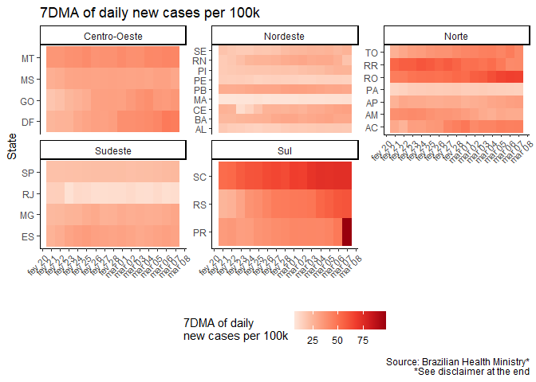<!-- -->

## Brasil (4)

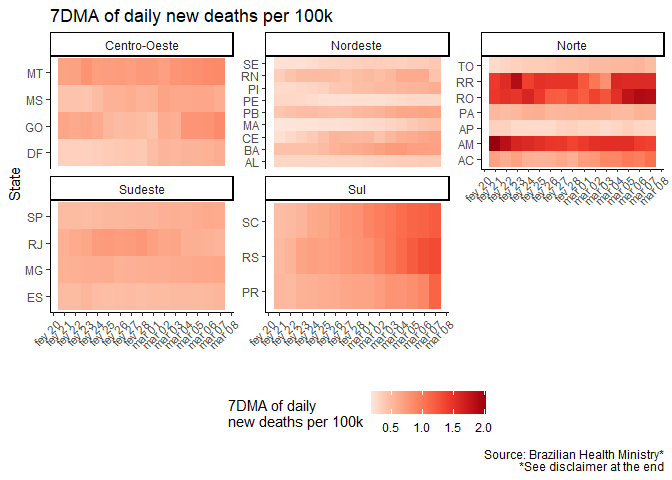<!-- -->

# Sudeste

## Novos casos nas últimas semanas

<!-- -->

## Novas mortes nas últimas semanas

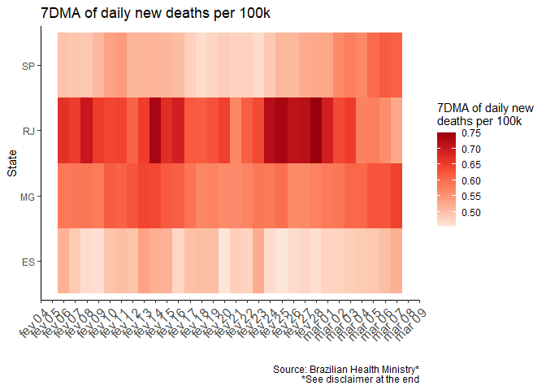<!-- -->

## Sudeste - New cases

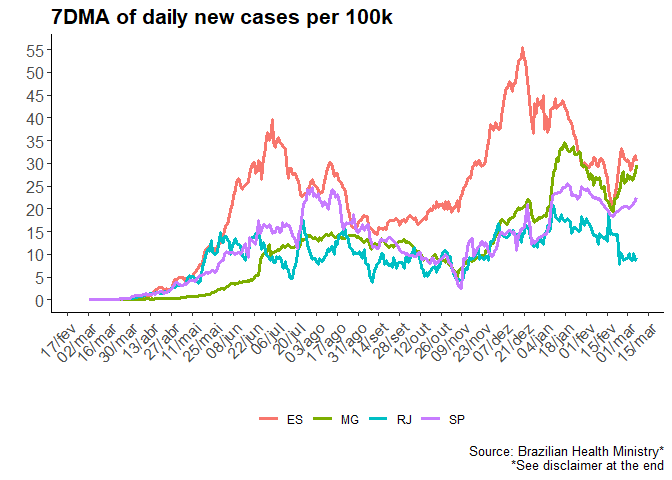<!-- -->

## Sudeste - New deaths

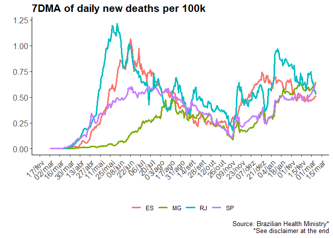<!-- -->

## Sudeste - Total cases

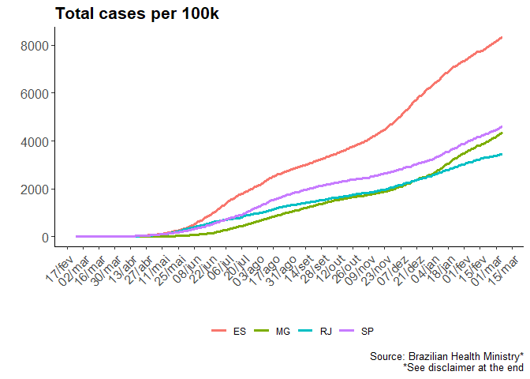<!-- -->

## Sudeste - Total Deaths

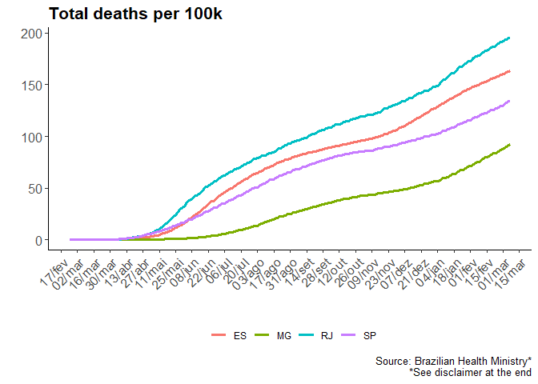<!-- -->

## São Paulo

<!-- -->

## Rio de Janeiro

<!-- -->

## Minas Gerais

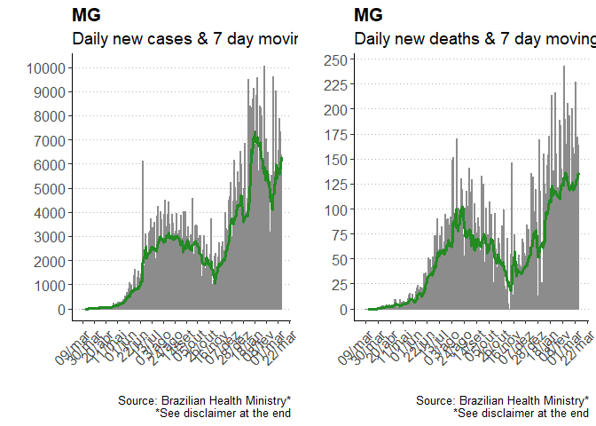<!-- -->

## Espírito Santo

<!-- -->

# Sul

## Novos casos nas últimas semanas

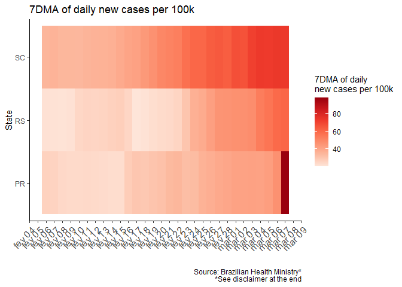<!-- -->

## Novas mortes nas últimas semanas

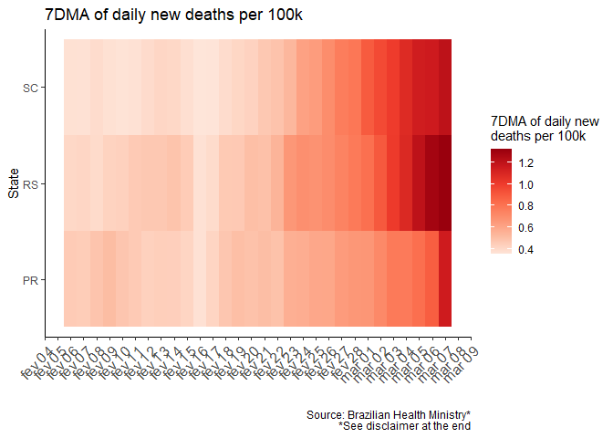<!-- -->

## Sul - New cases

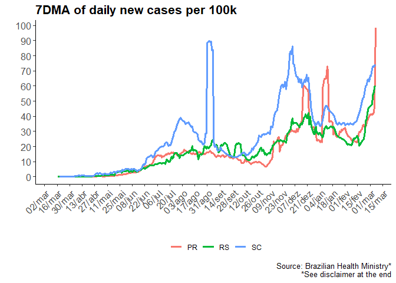<!-- -->

## Sul - New deaths

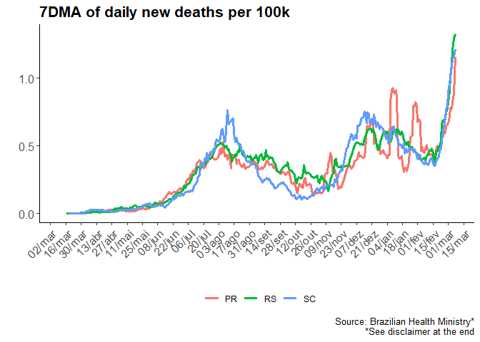<!-- -->

## Sul - Total cases

<!-- -->

## Sul - Total deaths

<!-- -->

## Santa Catarina

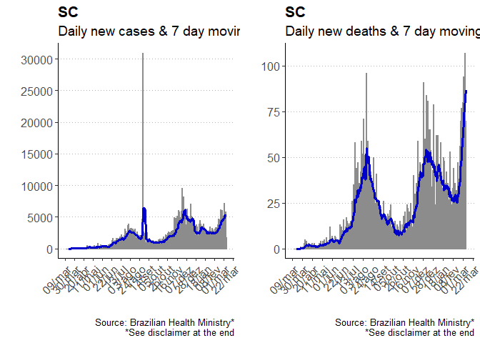<!-- -->

## Paraná

<!-- -->

## Rio Grande do Sul

<!-- -->

# Centro Oeste

## Novos casos nas últimas semanas

<!-- -->

## Novas mortes nas últimas semanas

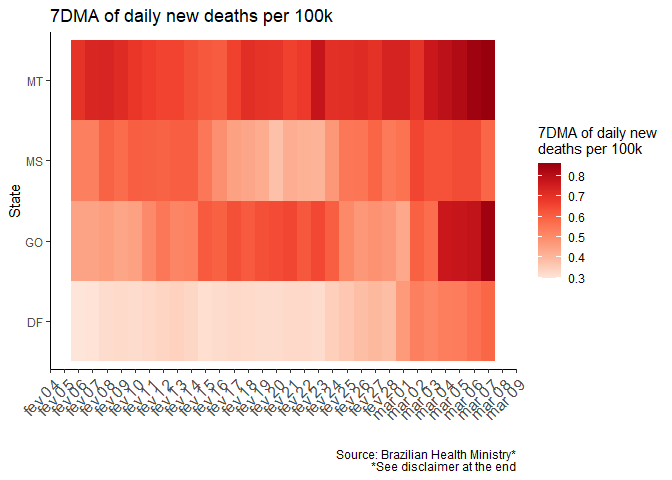<!-- -->

## Centro Oeste - New cases

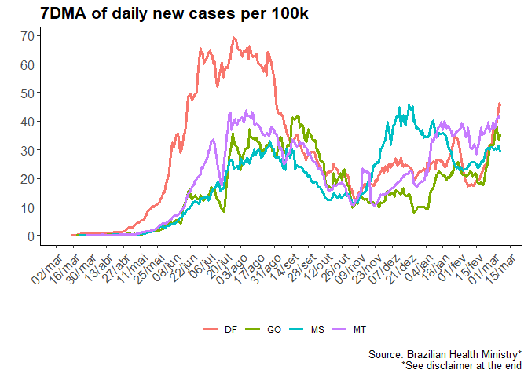<!-- -->

## Centro Oeste - New deaths

<!-- -->

## Centro Oeste - Total cases

<!-- -->

## Centro Oeste - Total deaths

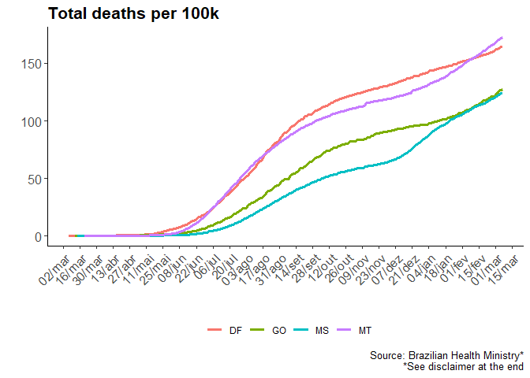<!-- -->

## Goiás

<!-- -->

## Mato Grosso

<!-- -->

## Mato Grosso do Sul

<!-- -->

## Distrito Federal

<!-- -->

# Nordeste

## Novos casos nas últimas semanas

<!-- -->

## Novas mortes nas últimas semanas

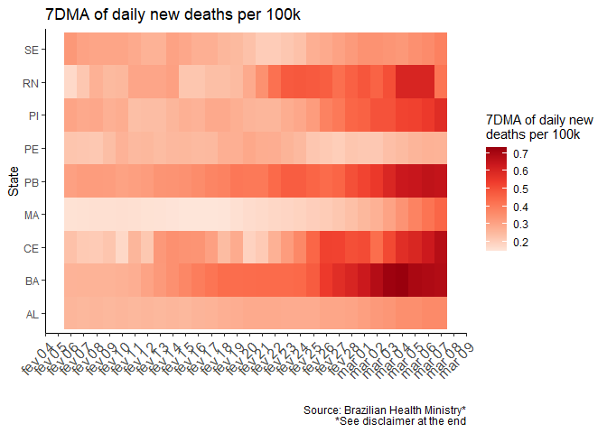<!-- -->

## Nordeste - New cases I

<!-- -->

## Nordeste - New cases II

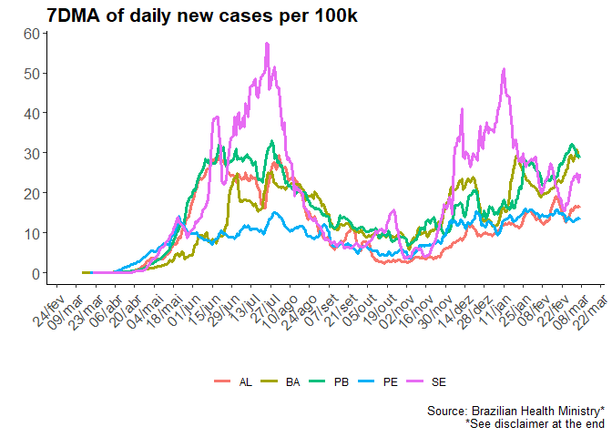<!-- -->

## Nordeste - New deaths I

<!-- -->

## Nordeste - New deaths II

<!-- -->

## Nordeste - Total cases I

<!-- -->

## Nordeste - Total cases II

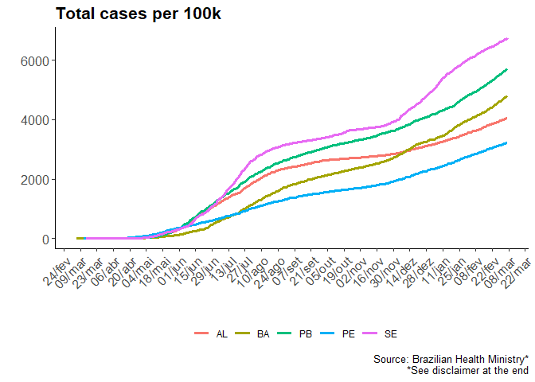<!-- -->

## Nordeste - Total deaths I

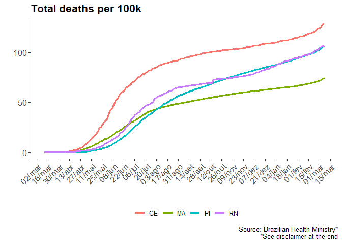<!-- -->

## Nordeste - Total deaths II

<!-- -->

## Alagoas

<!-- -->

## Bahia

<!-- -->

## Ceará

<!-- -->

## Maranhão

<!-- -->

## Paraíba

<!-- -->

## Pernambuco

<!-- -->

## Piauí

<!-- -->

## Rio Grande do Norte

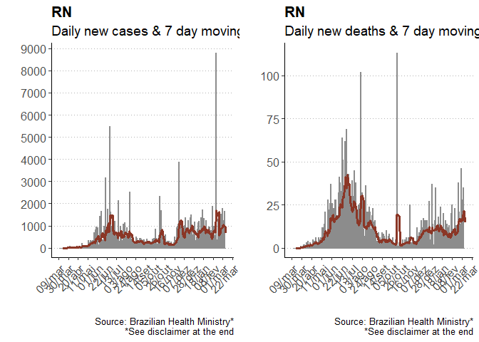<!-- -->

## Sergipe

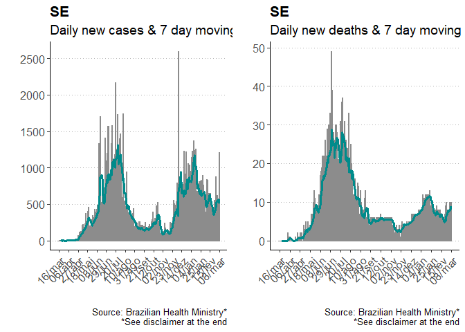<!-- -->

# Norte

## Novos casos nas últimas semanas

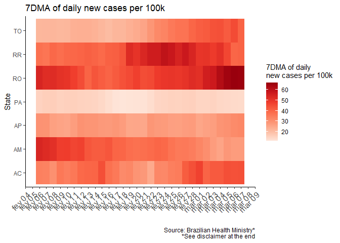<!-- -->

## Novas mortes nas últimas semanas

<!-- -->

## Norte - New cases I

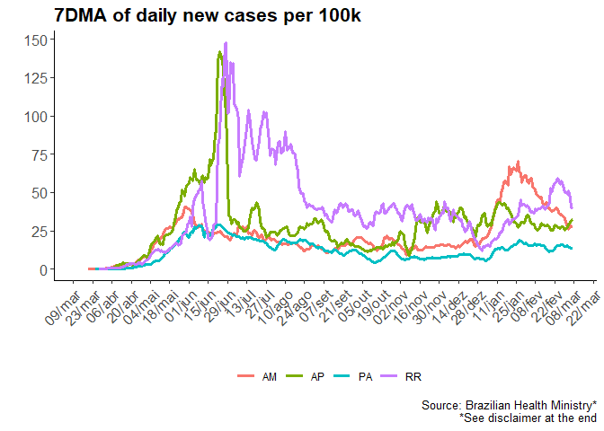<!-- -->

## Norte - New cases II

<!-- -->

## Norte - New deaths I

<!-- -->

## Norte - New deaths II

<!-- -->

## Norte - Total cases I

<!-- -->

## Norte - Total cases II

<!-- -->

## Norte - Total deaths I

<!-- -->

## Norte - Total deaths II

<!-- -->

## Amazonas

<!-- -->

## Roraima

<!-- -->

## Amapá

<!-- -->

## Pará

<!-- -->

## Tocantins

<!-- -->

## Rondônia

<!-- -->

## Acre

<!-- -->

# Data source

## Data source

Link: <https://github.com/wcota/covid19br>

Disclaimer: Dados do Ministério da Saúde até o dia em que estão
disponíveis. Para os mais recentes (e que ainda não foram divulgados
pelo Ministério da Saúde), dados das Secretarias Estaduais de Saúde.
